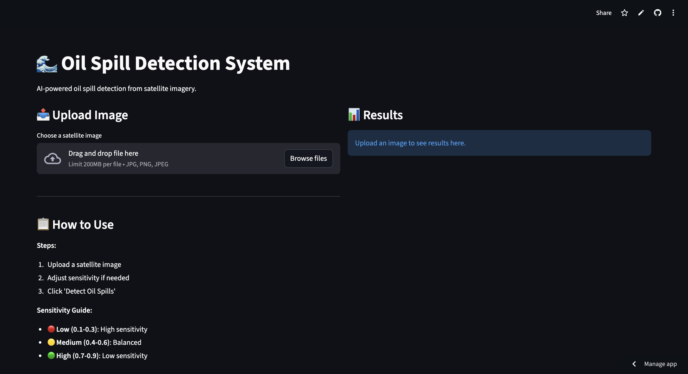
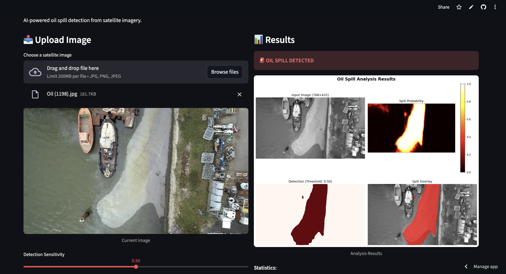
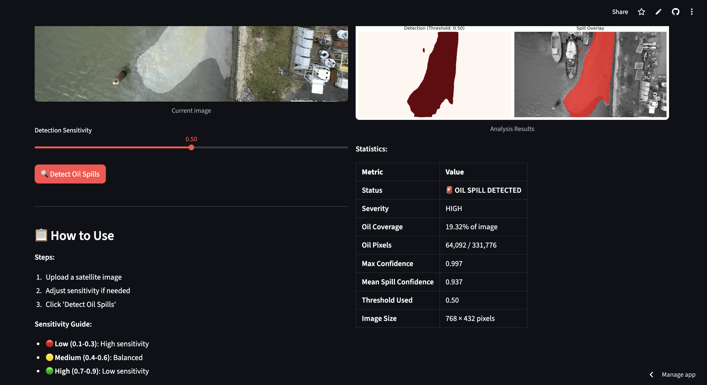
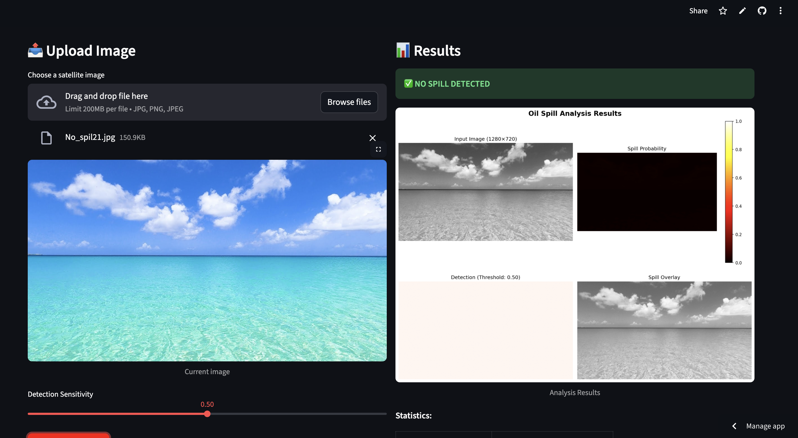
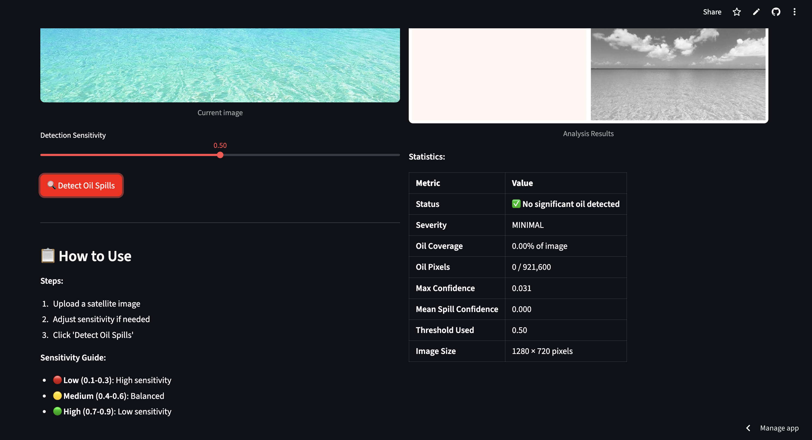

# 🌊 AI-Powered Oil Spill Detection and Segmentation

  


## 🚀 Live Demo

Live - (https://abhioilspill.streamlit.app/)


This project is a complete end-to-end deep learning solution for detecting and segmenting oil spills in satellite imagery. It uses a U-Net model built with PyTorch to perform semantic segmentation, classifying each pixel as either "oil spill" or "no spill". The trained model is deployed in a real-time, interactive, and analytical web application using Streamlit.

## ✨ Key Features

- **Accurate Segmentation:** Utilizes a U-Net architecture, achieving a high Intersection over Union (IoU) score of **0.88** on the test set.
- **Interactive Sensitivity Control:** Features a slider to adjust the prediction threshold, allowing users to balance between detecting faint spills and reducing false alarms.
- **Comprehensive Analysis Dashboard:** Generates a 4-panel plot showing the input image, a probability heatmap of the model's confidence, the final binary mask, and a red-channel overlay for clear visualization.
- **Detailed Statistical Reporting:** Provides a full report including spill coverage percentage, absolute pixel count, confidence scores, and a calculated severity level.
- **Portable Model:** The model can be exported to the ONNX format, making it ready for cross-platform deployment (e.g., in the Unity engine).


## 📸 Application Demo

The application provides a seamless, step-by-step workflow from upload to final analysis.

#### 1. Initial Interface
The app starts with a clean and welcoming interface, prompting the user to upload an image.


---

#### 2. Positive Detection: Uploading an Image with an Oil Spill
A user uploads an image containing a potential oil spill, After clicking "Detect Oil Spills," the model processes the image and presents a detailed 4-panel analysis and statistical report, confirming the presence and severity of the spill.




---

#### 3. Negative Detection: Uploading a Clean Image
Next, a user uploads a clean image,The model correctly analyzes the image and confirms that no significant oil spill is detected, showcasing its robustness.





## 💻 Technologies Used

- **AI & Deep Learning:** Python, PyTorch, U-Net, CNNs
- **Data & Image Processing:** OpenCV, Albumentations, NumPy, Pillow, Matplotlib
- **Deployment & Web:** Streamlit, Streamlit Community Cloud
- **Development Tools:** Git & GitHub, Google Colab

## ⚙️ How to Use the App

1.  Navigate to the application URL or run it locally.
2.  Upload an image using the **"Choose a satellite image"** button.
3.  The uploaded image will be displayed for confirmation.
4.  (Optional) Adjust the **"Detection Sensitivity"** slider. A lower value is more sensitive and will detect fainter spills.
5.  Click the **"Detect Oil Spills"** button to start the analysis.
6.  Review the comprehensive 4-panel visualization and the detailed statistics table in the results area.

## 🛠️ Setup and Local Installation

To run this project on your local machine, please follow these steps:

1.  **Clone the repository:**
    ```bash
    git clone [https://github.com/abhiramavarma/AI_SpillGuard_OSD-AbhiramaVarma_Nandayala.git](https://github.com/abhiramavarma/AI_SpillGuard_OSD-AbhiramaVarma_Nandayala.git)
    cd AI_SpillGuard_OSD-AbhiramaVarma_Nandayala
    ```

2.  **Create a virtual environment (recommended):**
    ```bash
    python -m venv venv
    source venv/bin/activate  # On Windows, use `venv\Scripts\activate`
    ```

3.  **Install the required dependencies:**
    ```bash
    pip install -r requirements.txt
    ```

4.  **Run the Streamlit application:**
    ```bash
    streamlit run app.py
    ```
    The application will open in your web browser.


